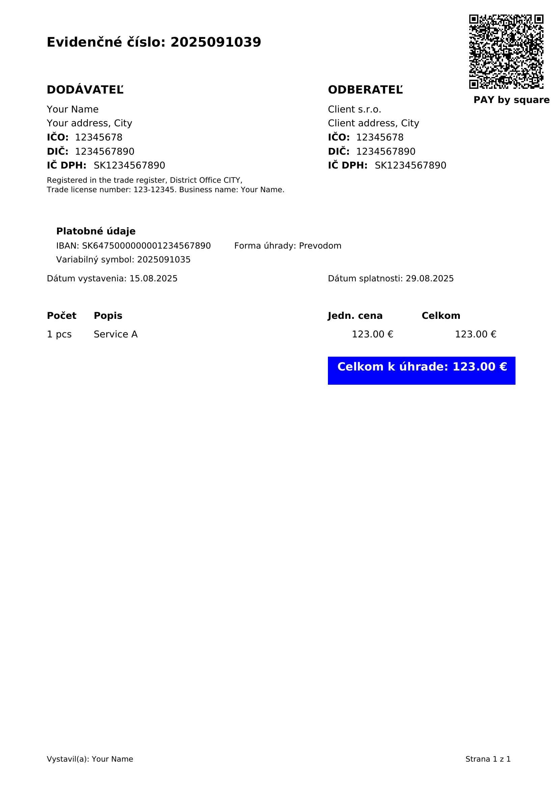

# 🧾 PAY by Square Invoice Generator

PDF invoice generator with Pay by Square QR code (Slovakia).

## Features
- Uses `reportlab` to build the PDF layout
- Generates valid Pay by Square QR code with `pay-by-square` library
- Embeds the QR code image with `qrcode`
- Reads invoice data from a simple text config (`invoice_data.txt`)

## Installation
```bash
pip install -r requirements.txt
```

## Usage
1. Copy `invoice_data_example.txt` to `invoice_data.txt` and adjust values
2. Run:
```bash
python main.py
```
The invoice PDF will be saved in the `invoices/` folder.

## Example Input (`invoice_data_example.txt`)
```ini
# ----- SUPPLIER -----
seller_name=Your Name
seller_address=Your address, City
iban=SK6475000000001234567890
bic=YOURBANKXXX
issue_date=15.08.2025
currency=EUR
days_due=14
note=Invoice for services

# ----- CLIENT -----
client_name=Client s.r.o.
client_address=Client address, City

# ----- ITEMS -----
items=
    Service A,1,pcs,123
```

## License
MIT © 2025 Dmytro Afanasiev

## Example
Input: `examples/sample_input.json`  
Output: `examples/sample_invoice.pdf`


